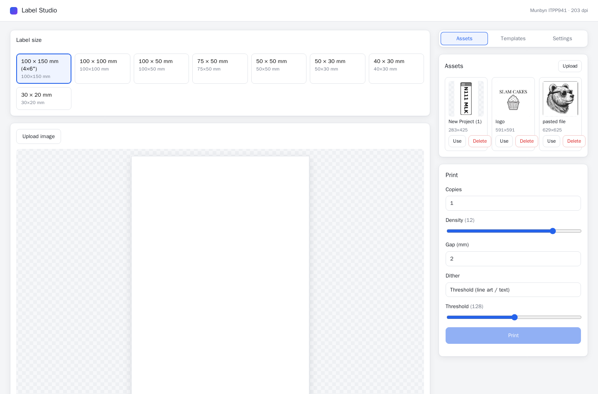

# Munbyn ITPP941 label printing on Linux + web designer studio

Run a **Munbyn ITPP941** thermal label printer from Linux and design/print labels
from a browser. Ships as a single Docker container (`label-studio`) deployed to a
Raspberry Pi, with the printer attached over USB.



> **The important discovery:** the ITPP941 is a **TSPL** printer (USB IEEE-1284
> id `CMD:XPP,XL`), **not ZPL**, and **CUPS cannot drive it** — its libusb backend
> detaches the kernel `usblp` driver and the printer never receives the data
> (prints nothing, then wedges). The working approach is to generate **TSPL** and
> write it **straight to the kernel device `/dev/usb/lp0`**. That's exactly what
> the studio does. Full story: [`docs/HOW-IT-WORKS.md`](docs/HOW-IT-WORKS.md).

## What you get

A web app at **`http://<pi>:8080`**:
- **Design canvas** — upload an image, free-transform (move/scale/rotate) with
  **edge/center snapping + guides**, sized to the label.
- **Size presets** — 100×150, 100×100, 100×50, 75×50, 50×50, 50×30, 40×30, 30×20 mm.
- **Asset library** — uploaded images are saved and reusable.
- **Templates** — save a design (size + image + placement + settings) and
  one-click **quick-print** it later.
- **Printer settings** — override **darkness (DENSITY 0–15)** and **gap (mm)**,
  globally or per-template.
- **Persistence** — assets, templates and settings live on a Docker volume
  (`munbyn-data` → `/data`) and survive restarts.

It prints by rendering your design to a 1-bit raster, wrapping it in TSPL
(`SIZE`/`GAP`/`DENSITY`/`BITMAP`/`PRINT`), and writing to `/dev/usb/lp0`.

## Layout

```
studio/                       # the app (see studio/README.md)
  web/                        # React + Vite + Konva SPA (the designer)
  server/                     # Fastify + sharp backend (TSPL + persistence)
    src/tspl.ts               # PNG -> 1-bit -> TSPL
    src/print.ts              # write TSPL to /dev/usb/lp0
    src/store.ts              # assets/templates/settings on /data
  shared/{presets,types}.ts   # frozen contracts shared by web + server
  Dockerfile, deploy-studio.sh
docker-compose.yml            # label-studio service (USB device + /data volume)
docs/HOW-IT-WORKS.md          # how the TSPL/direct-USB approach was found
ppd/                          # (legacy) the macOS PPD used during investigation
```

## Quick start (on the Pi)

1. Plug the Munbyn ITPP941 into the Pi's USB and power it on. Confirm the kernel
   device exists: `ls -l /dev/usb/lp0`.
2. Bring it up:
   ```bash
   cd ~/munbyn-cups && docker compose up -d --build
   ```
3. Open **`http://<rpi-ip>:8080`**.

From a workstation, `./studio/deploy-studio.sh` ships the context, builds natively
on the Pi (arm64), and pushes to `oci.arsalan.io/munbyn/label-studio`.

## Configuration (env)

| Variable          | Default          | Purpose                                  |
|-------------------|------------------|------------------------------------------|
| `PORT`            | `8080`           | web UI / API port                        |
| `PRINTER_DEVICE`  | `/dev/usb/lp0`   | kernel USB device to write TSPL to        |
| `DATA_DIR`        | `/data`          | persistence dir (mounted volume)         |
| `ENABLE_RAW_9100` | unset            | set `1` to accept raw TSPL on TCP `:9100`  |

## Troubleshooting

| Symptom | Fix |
|---|---|
| Prints **nothing** but jobs "complete" | The printer is wedged. **Power-cycle it** (off ~5s, on), then retry. Confirm with `printf 'SELFTEST\r\n' > /dev/usb/lp0`. |
| `/dev/usb/lp0` missing | `usblp` got detached. Re-enumerate: find the device under `/sys/bus/usb/devices` (`idVendor=09c6 idProduct=0248`), then `echo <name> | sudo tee /sys/bus/usb/drivers/usb/unbind` then `.../bind`. Don't run anything that uses libusb on it (e.g. CUPS). |
| Label content shifted/clipped | Pick the matching size preset; the design is rendered at exact label dots (203 dpi). |
| Too light/dark | Raise/lower **DENSITY** in Settings (0–15). |

## Network printing

The studio web UI is already LAN-accessible, so any device on the network can
design and print via the browser. A raw TSPL socket on `:9100` is available
(set `ENABLE_RAW_9100=1`) for tools that emit TSPL directly. True driverless
"Add Printer" (AirPrint) for this TSPL printer would need an IPP printer
application (e.g. LPrint via `file:///dev/usb/lp0`) — a possible future addition.

## License

[MIT](LICENSE) © 2026 Arsalan Naeem
